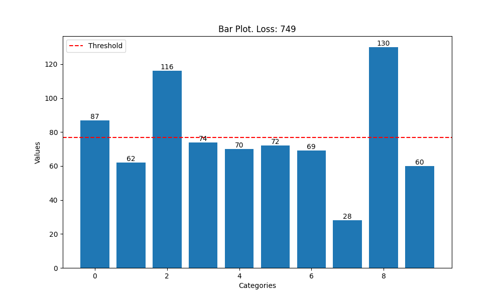
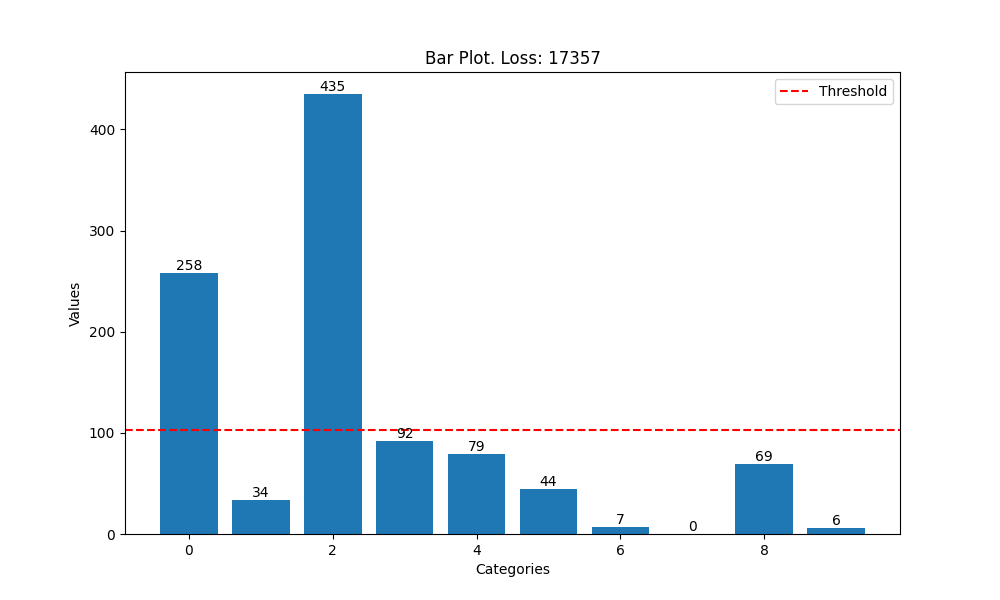

# WildlyMe 🦊

## WildlyMe is a personality test built using LLMs. 
### Answer 5 questions and you'll know which animal you are!

╰┈➤ Follow the [path](https://wildlyme-67kboof6.b4a.run/) to test it!

  

## Summary

WildlyMe uses scores produced by LLMs to find the best matching animal based on five answers.
The user experience is similar to the one of traditional personality tests; only the underlying scoring mechanism changes. This said, all questions and information on animals were generated through few-shot learning. Technically,
WildlyMe is a Flask app deployed on back4app with images stored on AWS.

## Basic principles and objectives

Personality tests need a way to match a set of answers to a set of categories (in this case, to animals). One possibility is to use scores for each answer and each animal. So for a question with four answers, and given that there are ten animals, we would need a table of 10 by 4 numbers. And since there are five questions, we would have five such tables. When a user has selected his answers, the columns in each table corresponding to the answers are summed up. The matching animal then corresponds to the row with the highest total score.
 
With this in mind, let us define a "good" behaviour of a personality test by giving two criteria:

1. the pairing of answers and animals is plausible, i.e. it does not contradict common knowledge on animals, e.g. if a user answers that he dislikes hierarchy, he should not be matched with a lion. 
2. the test is not a priori biased, i.e. the probability distribution over all animals of all possible combinations of answers is even.

## Objective 1: plausibility

To compensate for the lack of knowledge on animals, LLMs are used as experts to generate scores. They are given a question and its possible answers, and prompted to generate a number between -1.0 and 1.0 (with a spacing of 0.1) for each animal and each answer (as well as an explanation for the number). A score of 1.0 means that the given animal completely agrees with an answer, while a score of -1.0 indicates a complete disagreement. 0.0 is neutral.  

To get a higher confidence in the scores, two LLMs were used: Mistral Large 2 and Llama 3.1 405B. A manual review and agreement is then performed: close scores are averaged, while scores with a high discrepency call for a decision in favour of one against the other. This decision is made based on manual researches on the animal and explanations given by the LLMs.

## Objective 2: fairness

Given five questions and their scores, as well as ten animals, it is very likely that the distribution of all possible combinations of answers over the animals is far from even. One way to mitigate this is to have a larger pool of questions and pick the five questions that get the closest to an even distribution.  

18 questions were hence created as described above. Then, a global search for the optimal set of 5 questions was implemented. Since the number of 5 elements in a set of 18 is below 10.000, it ran fairly quickly. The resulting distribution is still far from perfect, see first plot below. The red dashed line represents the ideal distribution. The animal with the highest probability is about 4.5 times more likely to appear than the animal with the lowest probability. This said, the result is a great improvement over the initial set of 5 questions (see second plot below). Note that the red dashed line has different values between the plots: this is because not all questions have the same number of answers, which changes the total number of possibilities, and hence the average number as well.

## Sources

- [https://docs.mistral.ai/getting-started/models/](https://docs.mistral.ai/getting-started/models/)

- [Llama 3.1 405B](https://llamaai.online/llama-3-1-405b-free-online-chat-2/)

- [https://www.animalinyou.com/](https://www.animalinyou.com/)

- [back4app](https://www.back4app.com/)

- [AWS](https://aws.amazon.com/)
